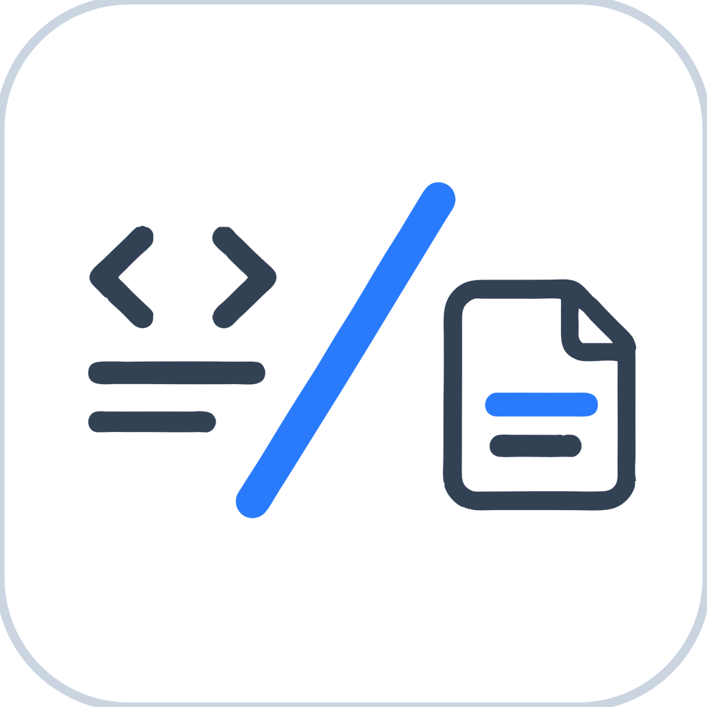
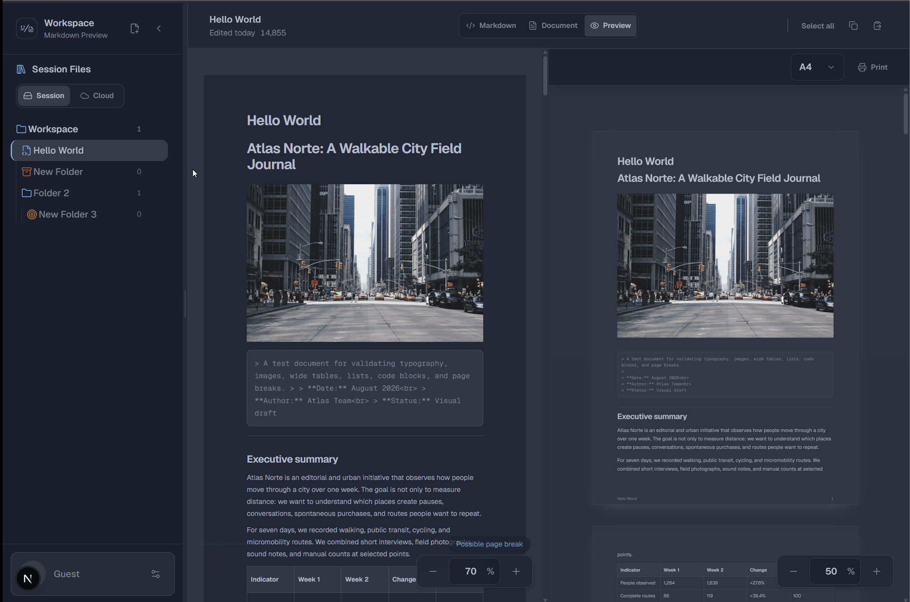
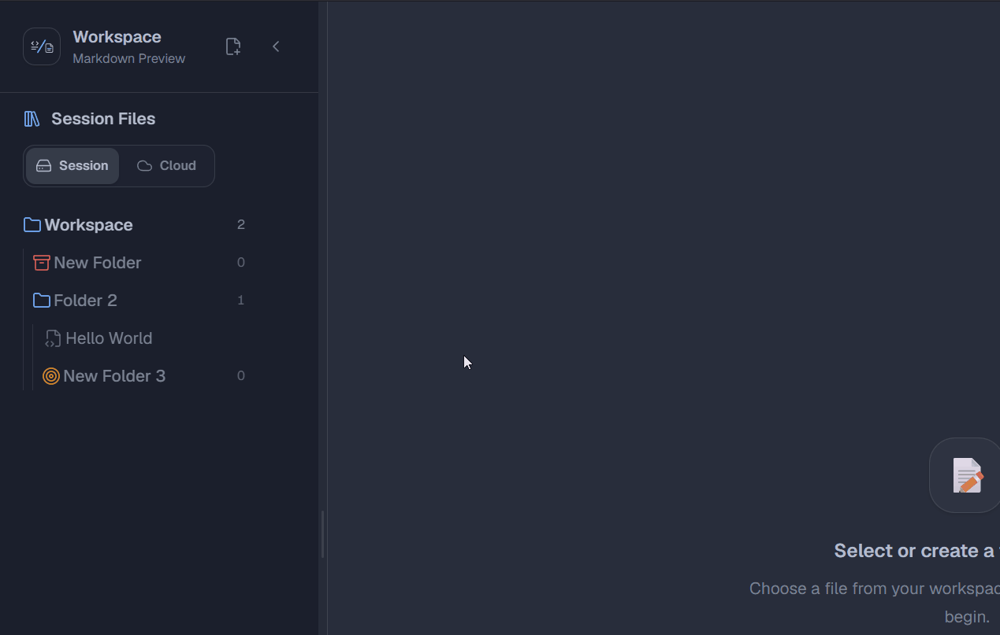
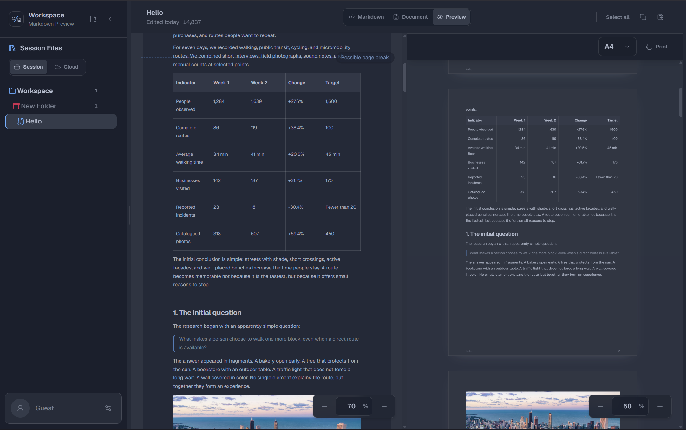
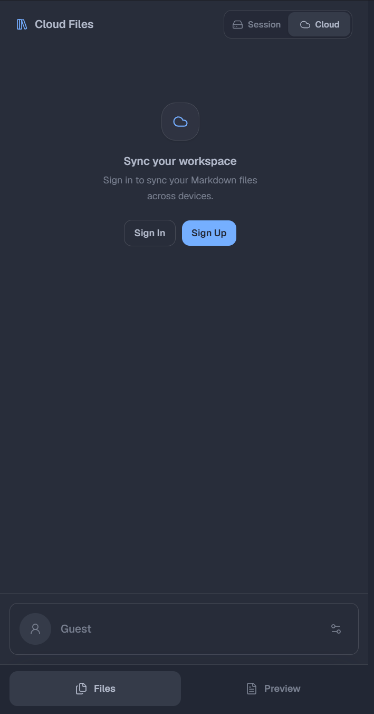
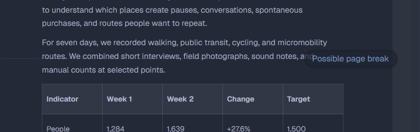

<p align="center">
  <a href="https://md-pdf-preview.andrew-lenz.com">
    
  </a>
</p>

<h1 align="center">md-pdf-preview</h1>

<p align="center">
  <a href="https://md-pdf-preview.andrew-lenz.com"><strong>md-pdf-preview.andrew-lenz.com</strong></a>
</p>

Write once. Preview every page.

A calm place to shape your Markdown documents and see exactly how they will read when they leave the screen — with a pagination engine that predicts real page breaks before you print.

<p align="center">
  <a href="https://github.com/AndrewLenz21/md-pdf-preview" target="_blank">
    View the source on GitHub
  </a>
</p>

## ✨ Features

| Feature | Description |
| ------- | ----------- |
| **📄 Fidelity-first preview** | A pagination engine measures every block (paragraphs, lists, code, blank space) and predicts exact page breaks — no more "why does my PDF look different?". |
| **✍️ Three editing modes** | Markdown source, WYSIWYG document (TipTap), and paper preview. Switch freely, edits stay in sync. |
| **📐 Real paper sizes** | A4, A5, Letter, and Legal with accurate margins, footers, and block spacing. Zoom in and out. |
| **🖨️ Print-ready** | Browser print output matches the preview page-for-page. |
| **📊 Paper-accurate preview** | Paragraph, list, and code-block pagination strategies with page-break markers synced to the editor scroll. |
| **🗂️ Document workspaces** | Folders and documents with drag-and-drop, rename, move, delete, and per-folder icons and colors. |
| **💾 Local-first** | Documents persist in IndexedDB. Works fully without an account. |
| **☁️ Optional cloud sync** | Sign in and keep your workspace in the cloud (PostgreSQL + Cloudflare R2). |
| **🌐 i18n** | English, Spanish, and Italian. |
| **🎨 Themes** | Dark and light, with smooth transitions. |
| **📱 Responsive** | Split desktop view, bottom navigation on mobile. |
| **♿ Accessibility** | Keyboard-resizable sidebar, ARIA-labeled controls, focus-visible styles. |

## 🖼️ Product Tour

### Create and preview a document

Create a Markdown file and see the same content in **Document** mode and **Preview** mode.

<p align="center">
  
</p>

### Organize files and folders

Move files and folders inside the local **Session** workspace with drag and drop.

<p align="center">
  
</p>

### Move folders to Cloud

Authenticated users can move workspace folders between **Session** and **Cloud**.

<p align="center">
  
</p>

### Desktop workspace

The desktop layout keeps the file tree, editor, and paper preview visible together.

<p align="center">
  
</p>

### Mobile workspace

The responsive layout switches to focused file and preview sections with bottom navigation.

<p align="center">
  
</p>

### Page-aware preview

The editor marks a possible page break while you work, helping you keep the printed result predictable.

<p align="center">
  
</p>

## 🛠️ Tech Stack

| Layer | Technology |
| ----- | ---------- |
| 🚀 Client | [Next.js](https://nextjs.org) 16 (App Router), React 19, TypeScript |
| ✍️ Editor | [TipTap](https://tiptap.dev) 3 (WYSIWYG) + unified/remark for Markdown parsing |
| 🔄 Serialization | turndown + turndown-plugin-gfm |
| 🗄️ State | Zustand (stores) + IndexedDB (local workspace) |
| 🌐 i18n | next-intl (en, es, it) |
| 🎨 Styling | Tailwind CSS v4 |
| ⚙️ Server | Go 1.25, Echo v4 |
| 🗃️ Database | PostgreSQL (pgx) |
| ☁️ Storage | Cloudflare R2 (S3-compatible) |
| 🔐 Auth | better-auth (email/password) |
| 🧪 Tests | Vitest + Testing Library (client), Go tests (server) |

## 🏗️ Architecture

```
md-pdf-preview/
├── apps/
│   ├── client/               # Next.js 16 — editor, preview, dashboard, Hono API routes
│   └── server/               # Go/Echo — workspace API, PostgreSQL, R2, rate limiting
├── packages/
│   ├── ui/                   # Shared React components (Button, Card, Code)
│   ├── eslint-config/        # Shared ESLint configurations
│   └── typescript-config/    # Shared tsconfig presets
├── turbo.json                # Turborepo pipeline
└── package.json              # npm workspaces
```

### Client Module Overview

| Module | Responsibility |
| ------ | -------------- |
| `⚙️ core` | Auth (better-auth), i18n routing, theme providers |
| `🔐 auth` | Sign in / sign up flows |
| `🧭 navigation` | Navbar, language/theme selectors, mobile drawer |
| `📊 dashboard` | The heart: document model, Markdown parser, editor, paper preview, pagination engine |
| `📁 docs-sidebar` | Folder tree, drag-and-drop, rename/move/delete dialogs |
| `📄 document` | Markdown parsing (incl. callouts), serialization, block model |
| `📐 preview` | Paper preview, block measurement, pagination strategies, print mode |
| `🗄️ stores` | Workspace, editor, local/cloud persistence (Zustand + IndexedDB) |
| `📦 shared` | Reusable hooks, dialogs, preferences (theme/locale) |

### Server Overview

| Area | Responsibility |
| ---- | -------------- |
| `⚙️ config` | Environment, PostgreSQL pool, Cloudflare R2, rate limiter, API-key middleware |
| `🎮 controllers` | Health, workspace |
| `🗃️ repositories` | PostgreSQL data access for workspace items and request logs |
| `🧩 services` | Workspace business logic, Cloudflare R2 presigned URLs, structured logging |
| `🧪 migrations` | Bootstrap and schema migrations for Postgres |

## 🚀 Getting Started

### Prerequisites

- **Windows 10/11** with PowerShell
- **Node.js** >= 18 and **npm** 11+
- **Go** 1.25+ (only for the backend)
- [**air**](https://github.com/air-verse/air) (only for backend hot-reload)

The development scripts and examples in this repository target Windows and PowerShell.

### Quickstart — client only (local workspace)

The client works standalone: no database, no backend, no account. Documents live in your browser's IndexedDB.

```powershell
# 1. Install dependencies (from the repo root)
npm install

# 2. Configure environment variables
Copy-Item apps/client/.env.example apps/client/.env.local

# 3. Start the client
npm run dev --filter=client
```

Open [http://localhost:3000](http://localhost:3000).

> **Note:** `BACKEND_URL` and `INTERNAL_API_KEY` are still required by the client's server-side proxy, but cloud features will simply report the backend as unavailable if it is not running.

### Full stack (cloud sync)

```powershell
# 1. Start PostgreSQL (or use Supabase/Neon)

# 2. Configure the server
Copy-Item apps/server/.env.example apps/server/.env

# 3. Configure the client with matching values
Copy-Item apps/client/.env.example apps/client/.env.local

# 4. Run everything
npm run dev
```

- Client: [http://localhost:3000](http://localhost:3000)
- Server: [http://localhost:8080](http://localhost:8080)

### Useful commands

```powershell
npm run dev             # Run all apps in development
npm run dev:client      # Run only the Next.js client
npm run dev:server      # Run only the Go server
npm run build           # Production build (all apps)
npm run build:client    # Production build for the client
npm run build:server    # Production build for the server
npm run preview:client  # Preview the client in the Cloudflare runtime
npm run deploy:client   # Build and deploy the client with Wrangler
npm run lint            # ESLint + go vet
npm run check-types     # TypeScript + Go tests
npm run test --workspace=client   # Vitest (client)
```

## 🧪 Testing

The project takes pagination seriously — and so does its test suite.

- **Client:** Vitest + Testing Library. Focus areas: Markdown parsing, TipTap ↔ Markdown conversion, pagination strategies (paragraph, list, code, blank space), measurement logic, stores, and persistence.
- **Server:** Go tests for controllers, services, repositories, and middlewares (rate limiter, API key, logger).

```powershell
# Client tests
npm run test --workspace=client

# Server tests
npm run check-types --workspace=server
```

## 🤝 Contributing

Contributions of all kinds are welcome — features, bug fixes, translations, docs. See [CONTRIBUTING.md](./CONTRIBUTING.md) for the full guide.

## 🗺️ Roadmap

See [ROADMAP.md](./ROADMAP.md) for what's done, in progress, and planned.

## 🔒 Security

Found a vulnerability? See [SECURITY.md](./SECURITY.md) for our disclosure process.

## 📚 Community and Policies

- [Support](./SUPPORT.md)
- [Changelog](./CHANGELOG.md)
- [Privacy notice](./PRIVACY.md)
- [Terms of use](./TERMS.md)
- [Asset attributions](./docs/ATTRIBUTIONS.md)

## 📄 License

[MIT](./LICENSE)

## 🤖 Built with AI

This project was developed with the assistance of [OpenCode](https://opencode.ai), an interactive CLI tool for software engineering tasks.

| Model | Role |
| ----- | ---- |
| 🏗️ GPT 5.6 Terra | Architecture decisions and code organization |
| 🧩 GPT 5.6 Luna | Module-level changes — one module at a time, without touching other areas |
| 🚀 DeepSeek V4 Flash | Deployment decisions and open source guidance |

All code was reviewed and tested before commit. Architecture decisions, data modelling, and final validation were human-led.
